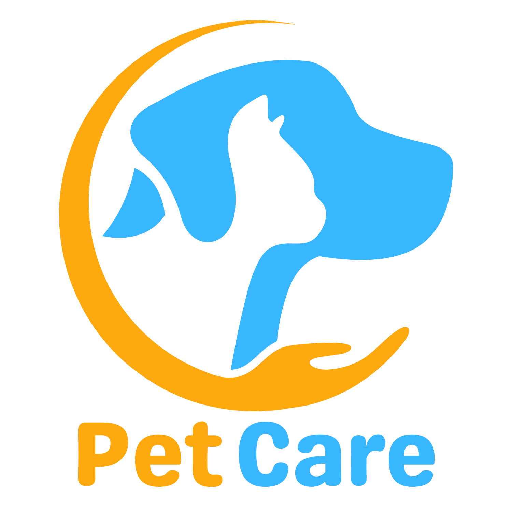

# PetCare
### Prototipo semifuncional de PetCare

PetCare es una aplicacion pensada para dispositivos moviles, se enfoca en el cuidado de mascotas en el ambito del usuario, el usuario podra llevar un registro de las actividades de su mascota, eventos, vacunas etc.

Por el momento, desarrollaremos un prototipo semifuncional en raylib, esto debido a falta de experiencia en el desarrollo de apps en andorid. Por lo tanto este prototipo esta limitado a computadoras con windows.

Las funciones que desarrollaremos son:
-   Agregación de mascota
-   Calendario
-   Cartilla medica

### Integrantes
- Antonio Ramos Gonzalez
- Adan Gonzalez Ceseña
- Andrea Rivas Gomez
- Teresa Rivas Gomez

### Recursos usados
- C ++
- Raylib
- POO
- VsCode

